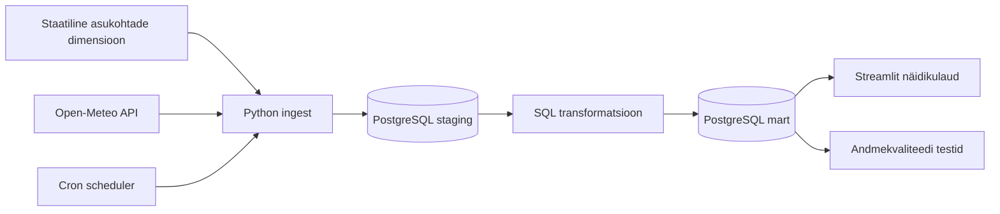

# Eesti äriregistri muutuste voog

Käesolev andmeinseneeria projekt ehitab otsast lõpuni andmetöövoo. Projekt loeb Äriregistri avaandmete API-st igapäevased muutuste väljavõtteid EMTAK tegevusalade ja maakondade kaupa ning täiendavalt loeb Statistikaameti API-st rahvastiku andmeid. Salvestab need PostgreSQL-i, leiab valdkonnad, kus registreeritakse kõige rohkem uusi ettevõtteid ning kus on juhatuse muudatuste sagedus kõige kõrgem, presenteerib rahvastiku jaotust, kontrollib andmekvaliteeti ja näitab tulemust Superseti näidikulaual. Äriregistri avaandmed uuenevad igapäevaselt. Statistikaameti andmed uuenevad kord kuus.
Scheduler ehk ajastaja konteiner värskendab andmeid vaikimisi iga xx alguses.

## Olulised lingid
Projekti kirjeldus: [Moodle](https://moodle.ut.ee/mod/data/view.php?d=1231&advanced=0&paging&filter=1&page=0&rid=19075)
Teams Koosolekulink: [T 19.05.2026 kell 18:00](https://teams.microsoft.com/meet/380111006617570?p=8IYORzSl4Yk78naD59)

## Äriküsimus

Millistes valdkondades registreeritakse enim uusi ettevõtteid ja kus on juhatuse muudatuste sagedus kõige kõrgem?

Näidikulaud kuvab (.. siia KPI-d ja viited graafikutele?):

- ...;
- ...

## Kuidas projekt täidab nõuded

| Nõue | Kuidas see näidis seda täidab |
|---|---|
| Selge äriküsimus | Ilma sobivus väliste tegevuste planeerimiseks valitud Eesti asulates. |
| Ajas muutuv andmeallikas | Open-Meteo ilmaennustus muutub ajas, kui prognoosi uuendatakse. |
| Automatiseeritud sissevõtt | `scheduler` konteiner käivitab töövoo croni ajakava järgi. Käsitsi saab sama teha käsuga `scripts/run_pipeline.py ingest`. |
| Vähemalt üks transformatsioon | `scripts/01_transform.sql` loob `staging` andmetest `mart` kihi tabelid, tunniskoorid ja 3-tunnised ajaaknad. |
| Staatiline dimensioon | `scripts/00_seed_dimensions.sql` täidab `mart.dim_location` tabeli asulate püsivate tunnustega. |
| Andmekvaliteedi testid | `scripts/02_quality_tests.sql` käivitab andmete ja skooride kontrollid. |
| Näidikulaud | Streamliti rakendus näitab parimaid ajaaknaid, sobivuse kalendrit ja ilmategurite ajatelgi. |
| Saladused `.env` failis | Ühenduse seaded tulevad `.env` failist. Repos on ainult `.env.example`. |
| README | See fail kirjeldab äriküsimust, arhitektuuri ja käivitamist. |

## Arhitektuur



Andmekihid:

- `staging` hoiab API-st saadud tunnipõhist lähtekuju;
- `mart` hoiab staatilist asukohadimensiooni, ilmaennustuse fakti, tunniskoore, ajaaknaid ja päevast koondit;
- `quality` hoiab andmekvaliteedi testide tulemusi.

Asukohad on eraldi dimensioonitabelis `mart.dim_location`. Faktitabelites hoitakse ajas muutuvat ilmaennustust ja viidatakse asukohale võtmega `location_id`. See teeb nähtavaks dimensionaalse modelleerimise põhimõtte: püsivad kirjeldavad tunnused on dimensioonis, mõõdetavad või ajas muutuvad väärtused on faktides.

## Eeldused

Sammud tehakse hosti terminalis ehk selles terminalis, kus saad kasutada `docker compose` käsku.

Vaja on:

- Docker Desktop või muu Docker Compose keskkond;
- ligipääs internetile, et Open-Meteo API-st andmeid lugeda;
- vaba port `55432` PostgreSQL-i jaoks ja `8501` näidikulaua jaoks.

Kui port on hõivatud, muuda `.env` failis väärtusi `DB_PORT_HOST` või `DASHBOARD_PORT_HOST`.

## Käivitamine

Mine projekti kausta:

```bash
cd andmeinseneride-projekt
```

Loo `.env` fail. See fail sisaldab kohaliku arenduskeskkonna seadeid ja seda ei laadita GitHubi.

```bash
cp .env.example .env
```

# Käivita teenused. Scheduler ehk ajastaja teeb esimese laadimise käivitumisel  ise, sest `.env.example` failis on `RUN_ON_STARTUP=true`.

```bash
docker compose up -d --build
```

Kui sul oli sama projekt vanema skeemiga juba käivitatud, kustuta enne vana andmebaasimaht:

```bash
docker compose down -v
docker compose up -d --build
```
# meie projektis: Käivita skriptid:

```bash
MSYS_NO_PATHCONV=1 docker exec -it andmeinseneeria-pipeline python /app/scripts/01_load_statistikaamet.py
```
```bash
MSYS_NO_PATHCONV=1 docker exec -it andmeinseneeria-pipeline python /app/scripts/02_01_load_ariregister_yldandmed.py
```

```bash
MSYS_NO_PATHCONV=1 docker exec -it andmeinseneeria-pipeline python /app/scripts/02_02_load_ariregister_muudatused.py
```

```bash
MSYS_NO_PATHCONV=1 docker exec -it andmeinseneeria-pipeline python /app/scripts/02_03_load_ariregister_registrikaart(äkki).py
```

```bash
MSYS_NO_PATHCONV=1 docker exec -it andmeinseneeria-pipeline python /app/scripts/03_load_emtak.py
```
dbt käivitamiseks
```bash
MSYS_NO_PATHCONV=1 docker exec -it andmeinseneeria-pipeline bash -c "cd /app/dbt_project/rik_stat_dbt && dbt run"
```


Kui tahad töövoogu käsitsi uuesti käivitada, kasuta järgmist käsku:

```bash
docker compose exec pipeline python scripts/run_pipeline.py run-all
```

Oodatav tulemus: terminalis on näha, et aktiivsete asukohtade kohta laaditi tunniread, transformatsioon lõppes ning kõik kvaliteeditestid said oleku `passed`.

Kontrolli tulemusi käsureal:

```bash
docker compose exec pipeline python scripts/run_pipeline.py check
```

Ava näidikulaud brauseris:

```text
http://localhost:8501
```

Näidikulaud värskendab andmevaadet vaikimisi iga 15 sekundi järel. Seda saab muuta `.env` faili väärtusega `DASHBOARD_AUTOREFRESH_SECONDS`. Väärtus `0` lülitab automaatse värskenduse välja. Värskendus ei tee brauseri täislaadimist, seega jäävad asukohafiltrid alles.

Scheduleri logisid saad vaadata nii:

```bash
docker compose logs -f scheduler
```

## Korduskäivitused ja vanad andmed

Iga laadimine saab uue `run_id`. Vanad laadimised jäävad alles tabelitesse `staging.pipeline_runs` ja `staging.weather_hourly_raw`, kuni käivitad käsu `reset` või kustutad andmebaasi mahu käsuga `docker compose down -v`.

Transformatsioon ehitab ajas muutuvad `mart` tabelid uuesti kõigi alles olevate staging ridade põhjal. Staatiline `mart.dim_location` jääb alles ja seda värskendab `scripts/00_seed_dimensions.sql`. Näidikulaud kasutab `latest_*` vaateid, seega kuvatakse otsuste tegemiseks viimase eduka laadimise prognoos. Vanemad laadimised jäävad andmebaasi alles hilisemaks võrdluseks või auditeerimiseks.

## Töövoo käsud

Kõik käsud käivitatakse hosti terminalis näidisprojekti kaustast.

| Käsk | Mida teeb |
|---|---|
| `docker compose exec pipeline python scripts/run_pipeline.py ingest` | Pärib API-st ilmaandmed ja salvestab need `staging` kihti. |
| `docker compose exec pipeline python scripts/run_pipeline.py transform` | Ehitab `mart` kihi tabelid. |
| `docker compose exec pipeline python scripts/run_pipeline.py test` | Käivitab andmekvaliteedi testid. |
| `docker compose exec pipeline python scripts/run_pipeline.py check` | Näitab viimase laadimise, parimate ajaakende ja testide ülevaadet. |
| `docker compose exec pipeline python scripts/run_pipeline.py run-all` | Käivitab kogu töövoo õiges järjekorras. |
| `docker compose exec pipeline python scripts/run_pipeline.py reset` | Tühjendab andmetabelid. |

Automaatne käivitus kasutab `.env` faili muutujat `PIPELINE_CRON`. Vaikimisi väärtus `"0 * * * *"` tähendab, et töövoog käivitub iga tunni alguses. Croni vorming on `minut tund kuupaev kuu nadalapaev`.

## Andmeallikas

Asukohtade staatiline dimensioon on failis `scripts/00_seed_dimensions.sql`. Näidises on aktiivsed asukohad Tallinn, Tartu, Pärnu, Narva, Rakvere, Otepää, Kohtla-Järve, Viljandi, Võru, Kuressaare, Haapsalu, Valga, Paide ja Jõhvi.

Põhiandmeallikas on [Open-Meteo Forecast API](https://open-meteo.com/en/docs).

Näidis kasutab tunnipõhiseid välju:

- `temperature_2m` ehk õhutemperatuur 2 meetri kõrgusel;
- `precipitation` ehk sademed millimeetrites;
- `precipitation_probability` ehk sademete tõenäosus protsentides;
- `is_day` ehk kas prognoositund on päevavalges või mitte;
- `wind_speed_10m` ehk tuulekiirus 10 meetri kõrgusel. Open-Meteo vaikimisi ühik on `km/h`, aga näidisprojekt küsib selle välja parameetriga `wind_speed_unit=ms`, et andmebaasis ja näidikulaual oleks väärtus ühikus `m/s`.

API ei vaja selle õppeprojekti jaoks võtit. Kui kasutad sama allikat oma projektis, lisa README-sse andmeallika viide ja järgi Open-Meteo kasutustingimusi.

## Sobivuse skoor

Projekt arvutab iga prognoositunni kohta sobivuse skoori vahemikus 0 kuni 100.

| Tegur | Maksimumpunktid | Hea näide |
|---|---:|---|
| Temperatuur | 30 | 16 kuni 24 kraadi |
| Sademed ja sademete tõenäosus | 35 | 0 mm ja kuni 20% tõenäosus |
| Tuul | 25 | kuni 4 m/s |
| Päevavalgus | 10 | `is_day = 1` |

Tunniskooridest ehitatakse 3-tunnised libisevad ajaaknad. Näidikulaud järjestab need keskmise skoori järgi ja näitab ka peamist põhjust, miks aken sobib või ei sobi.

## Andmekvaliteedi testid

Projekt kontrollib muu hulgas, et:

- asukohtade dimensioonis on aktiivseid ridu;
- aktiivsetel asukohtadel on koordinaadid;
- viimane edukas laadimine sisaldab andmeid;
- viimasel edukal laadimisel on kõik aktiivsed asukohad olemas;
- prognoosi aeg ei puudu;
- sama käivituse, asukoha ja tunni kohta ei teki duplikaate;
- temperatuur, sademed ja tuulekiirus jäävad mõistlikesse piiridesse;
- sademete tõenäosus jääb vahemikku 0 kuni 100;
- päevavalguse tunnus on 0 või 1;
- sobivuse skoor jääb vahemikku 0 kuni 100;
- päevane koondtabel sisaldab näidikulaua ridu;
- ajaakende tabel sisaldab välitegevuste soovitusi.

Testide tulemused salvestatakse tabelisse `quality.test_results` ja on näha ka näidikulaual.

## Failid

| Fail või kaust | Roll |
|---|---|
| `compose.yml` | Käivitab PostgreSQL-i, töövoo konteineri, scheduleri ja Streamliti näidikulaua. |
| `.env.example` | Näitab, milliseid keskkonnamuutujaid projekt vajab. |
| `init/01_create_objects.sql` | Loob andmebaasi skeemid ja tabelid. |
| `scripts/00_seed_dimensions.sql` | Täidab staatilise asukohadimensiooni. |
| `scripts/run_pipeline.py` | Orkestreerib API-päringu, laadimise, transformatsiooni ja testid. |
| `scripts/start_cron.sh` | Käivitab scheduler konteineris croni ja töövoo ajastatud jooksutamise. |
| `scripts/01_transform.sql` | Ehitab `mart` kihi tabelid, skoorid, ajaaknad ja vaated. |
| `scripts/02_quality_tests.sql` | Käivitab andmekvaliteedi kontrollid. |
| `scripts/03_check_results.sql` | Sisaldab käsitsi kontrollimiseks sobivaid SQL-päringuid. |
| `dashboard/app.py` | Streamliti näidikulaud. |
| `docs/arhitektuur.md` | Näidis esimeseks projektinädalaks. |
| `docs/progress.md` | Näidis teise projektinädala edenemisraportiks. |

## Kuidas seda enda projektiks muuta

Baastaseme jaoks piisab, kui muudad järgnevat:

1. vali enda äriküsimus;
2. muuda `scripts/00_seed_dimensions.sql` failis staatilise dimensiooni ridu;
3. vaheta API või lisa teine lihtne allikas;
4. muuda `mart.hourly_weather_score` ja `mart.outdoor_activity_windows` loogikat oma mõõdikute järgi;
5. lisa vähemalt 3 oma andmete jaoks sisukat kvaliteeditesti;
6. kohanda näidikulaud oma mõõdikutele.

Edasijõudnute jaoks sobivad laiendused:

- vii transformatsioonid dbt projekti;
- lisa Airflow DAG, mis käivitab töövoo ajakava järgi;
- asenda Streamlit Supersetiga;
- lisa andmekataloogi kirjeldused ja andmete pärinevuse vaade;
- lisa inkrementaalne laadimine, mis töötleb ainult uue prognoosisnapshot'i.

## Koristamine

Peata teenused:

```bash
docker compose down
```

Peata teenused ja kustuta andmebaasi maht:

```bash
docker compose down -v
```
