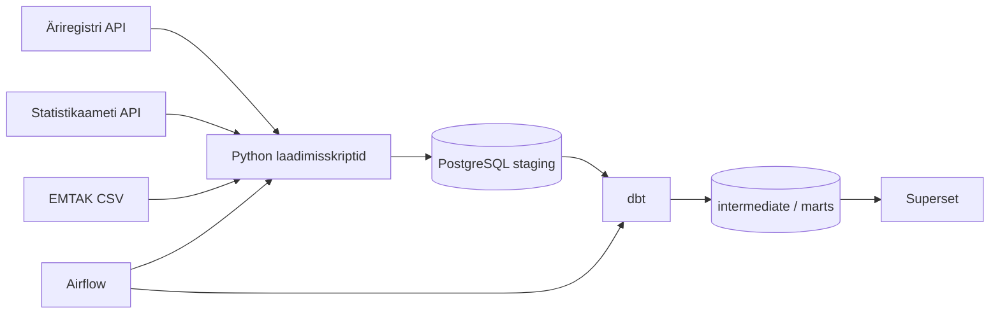

# Eesti äriregistri muutuste voog

Otsast lõpuni andmeinseneeria töövoog: Äriregistri avaandmete API-st igapäevased muutused (EMTAK, maakondad), Statistikaameti rahvastikuandmed, PostgreSQL, dbt transformatsioonid, Airflow orkestreerimine ja Superseti näidikulaud.

Äriregistri avaandmed uuenevad igapäevaselt; Statistikaameti andmed kord kuus.

## Olulised lingid

- Projekti kirjeldus: [Moodle](https://moodle.ut.ee/mod/data/view.php?d=1231&advanced=0&paging&filter=1&page=0&rid=19075)

## Äriküsimus

Millistes valdkondades registreeritakse enim uusi ettevõtteid ja kus on juhatuse muudatuste sagedus kõige kõrgem?

Täpsem mõõdikute ja otsuste kirjeldus: [`docs/arhitektuur.md`](docs/arhitektuur.md).

## Nõuete täitmine

| Nõue | Kuidas projekt seda täidab |
|---|---|
| Selge äriküsimus | EMTAK ja maakondade kaupa uute ettevõtete ning ettevõtlikkuse analüüs. |
| Ajas muutuv andmeallikas | Äriregistri igapäevased väljavõtted; Statistikaameti kuine uuendus. |
| Automatiseeritud sissevõtt | Airflow DAG-id (`airflow/dags/`). |
| Transformatsioon | dbt mudelid (`dbt_project/rik_stat_dbt/`): staging → intermediate → marts. |
| Staatiline dimensioon | EMTAK CSV-d, `dbt seed` (maakonnad), dimensioonivaated. |
| Andmekvaliteedi testid | `dbt test` (DAG-ide lõpus). |
| Näidikulaud | Superset (automaatne import `superset/dashboards/` zipist käivitamisel). |
| Saladused | `.env` (repos ainult `.env.example`). |

## Arhitektuur



Andmekihtide ülevaade: [`docs/arhitektuur.md`](docs/arhitektuur.md).

## Eeldused

- Docker Desktop (või muu keskkond, kus töötab `docker compose`)
- Internet (RIK ja Statistikaameti API)
- Vabad portid vastavalt `.env`-ile (vaikimisi analüütika-DB `55432`, Airflow `8081`, Superset `8088`, dbt docs `18080`)

## Käivitamine

```bash
cd andmeinseneride-projekt
cp .env.example .env
# täida .env (POSTGRES_*, ARIREGISTER_*, SUPERSET_*, vajadusel AIRFLOW_UID)
docker compose up -d --build
docker compose ps
```

Kui vana stacki skeem või maht segab (tühi algus):

```bash
docker compose down -v
docker compose up -d --build
```

Esimene käivitus võtab mõne minuti (`airflow-init`, `superset-init`).

### Teenused

| Teenus | URL / ligipääs |
|---|---|
| Airflow UI | http://localhost:8081 — kasutaja/parool `.env`-ist (`_AIRFLOW_WWW_USER_*`, vaikimisi `airflow` / `airflow`) |
| Superset | http://localhost:8088 — admin `.env`-ist (`SUPERSET_ADMIN_*`) |
| PostgreSQL (analüütika) | `localhost:${DB_PORT_HOST:-55432}` — `POSTGRES_*` |
| dbt dokumentatsioon | http://localhost:18080 (vt allpool) |

### Airflow DAG-id

DAG-id on vaikimisi **pausil** — ava UI, **unpause**, seejärel käivita bootstrap.

| DAG | Ajakava | Mida teeb |
|---|---|---|
| `andmestiku_esmane_taitmine` | käsitsi | EMTAK → staging, `dbt deps`, `dbt seed`, dimensioonivaated |
| `rahvastik_kuine` | iga kuu, 1. kp 04:00 | Rahvastik → dbt staging → intermediate → marts → test |
| `ariregister_paevane` | iga kuu, 1. kp 03:00 | Äriregistri üldandmed → dbt kihid → test |
| `ariregister_incremental_daily` | iga päev 03:30 | Inkrementaalne Äriregistri laadimine |

**Esmane käivitus pärast kloonimist:**

1. **Trigger** `andmestiku_esmane_taitmine` (üks kord).
2. **Trigger** `rahvastik_kuine`.
3. **Trigger** `ariregister_paevane` (või oota ajakava).
4. Jäta `ariregister_incremental_daily` unpause’itud igapäevaseks täienduseks.

Mudelite valik: [`dbt_project/rik_stat_dbt/selectors.yml`](dbt_project/rik_stat_dbt/selectors.yml). Uue `.sql` faili lisamisel `models/marts/` piisab DAG-i uuesti triggerdamisest.

`./dbt_project` on mountitud Airflow konteineritesse; DAG-e ei pea dbt-mudelite pärast muutma.

## Logid ja peatamine

```bash
docker compose logs -f airflow-scheduler
docker compose logs superset-init   # Superseti esmane seadistus / dashboard import
docker compose down                 # peatab teenused
docker compose down -v              # + kustutab mahud (PostgreSQL, Airflow meta, Superset)
```

Ainult Airflow peatamiseks (ülejäänud jääb tööle):

```bash
docker compose stop airflow-apiserver airflow-scheduler airflow-dag-processor airflow-db
```

Windows Git Bash: lisa `MSYS_NO_PATHCONV=1` eesliiteks, kui `docker exec` teekonda moonutab.

## Arendus ja diagnostika (valikuline)

Töövoog jookseb Airflow kaudu. Käsitsi testimiseks saab sama skripte käivitada `pipeline` konteineris:

```bash
MSYS_NO_PATHCONV=1 docker compose exec pipeline python scripts/03_load_emtak.py
MSYS_NO_PATHCONV=1 docker compose exec pipeline python scripts/01_load_statistikaamet.py
MSYS_NO_PATHCONV=1 docker compose exec pipeline python scripts/02_01_load_ariregister_yldandmed.py
MSYS_NO_PATHCONV=1 docker compose exec pipeline python scripts/04_load_ariregister_incremental.py
```

dbt ühe DAG-etapi asemel (`pipeline` või `dbt` teenus):

```bash
docker compose exec pipeline bash -c "cd dbt_project/rik_stat_dbt && dbt run --selector layer_marts"
docker compose exec dbt dbt debug
docker compose exec dbt dbt build
```

### dbt dokumentatsioon (veeb)

```bash
docker compose up -d dbt
docker compose exec dbt dbt docs generate
docker compose exec dbt dbt docs serve --port 8080 --host 0.0.0.0 --no-browser
```

Ava http://localhost:18080 — peatamiseks `Ctrl+C` exec-sessioonis.

### Superset ja analüütika-andmebaas

Kui automaatne dashboardi import ebaõnnestub (`superset-init` logid), lisa ühendus käsitsi: **Settings → Database Connections → PostgreSQL**

| Väli | Väärtus |
|---|---|
| Host | `db` |
| Port | `5432` |
| Database | `POSTGRES_DB` |
| User / Password | `POSTGRES_USER` / `POSTGRES_PASSWORD` |

## Andmeallikad

| Allikas | Kasutus |
|---|---|
| [Äriregistri avaandmed](https://avaandmed.ariregister.rik.ee/) | Põhivoog (`ARIREGISTER_*` `.env`-is) |
| [Statistikaameti PxWeb API](https://andmed.stat.ee/) | Rahvastik (`STAT_API_URL`) |
| `data/EMTAK_*.csv` | EMTAK dimensioonid |

## Projekti struktuur

| Kaust / fail | Roll |
|---|---|
| `compose.yml` | PostgreSQL, pipeline, dbt, Superset, Airflow |
| `airflow/dags/` | Orkestreerimine |
| `scripts/` | Python laadimisskriptid |
| `dbt_project/rik_stat_dbt/` | Transformatsioonid ja testid |
| `superset/` | Konfiguratsioon ja dashboardi eksport |
| `data/` | EMTAK CSV-failid |
| `.env.example` | Keskkonnamuutujad |
| `docs/arhitektuur.md` | Arhitektuur, mõõdikud, andmemudel |

## Koristamine

```bash
docker compose down
docker compose down -v
```