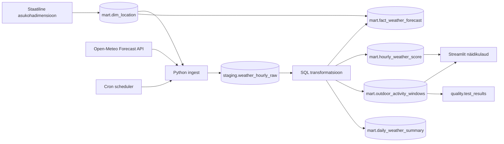

# Arhitektuur

## Äriküsimus

Millistes valdkondades registreeritakse enim uusi ettevõtteid ja kus on juhatuse muudatuste sagedus kõige kõrgem?

## Mõõdikud

1. Top x / Uued ettevõtted maakondade ..
2. Juhatuse muudatused ...
3. Toetav kontekst: rahvastikujaotus maakondades.

## Andmeallikad

| Allikas | Tüüp | Muutuvus ajas | Kasutus |
|---|---|---|---|
| Äriregistri avaandmete API | Avalik HTTP API | Igapäevased muutuste väljavõtted | Põhiandmevoog |
| Statistikaameti PxWeb API | Avalik JSON-stat API | Uueneb kord kuus | Rahvastiku andmed maakondade kaupa |
| EMTAK_2025.csv | Staatiline failiressurss | Automaatselt ei muutu. Muutub kui ise muuta | EMTAK tasemete nimekiri |
| maakond.geojson | Staatiline failiressurss | Automaatselt ei muutu. Muutub kui ise muuta | Maakondade dimensioonitabel? |

## Andmevoog

## Andmebaasi kihid

| Kiht | Roll |
|---|---|
| `staging` | Hoiab API-st saadud read allikalähedaselt. |
| `intermediate` | Andmete transformatsiooni kiht. |
| `marts` | Analüütikaks ehitatud tabelid (Supersetti loetav kiht). |
| `quality` | Hoiab kvaliteeditestide tulemusi. |

Iga töövoo käivitus saab uue `run_id`. Vanad API vastused jäävad `staging` kihti alles. `mart.dim_location` jääb staatiliseks dimensiooniks, teised `mart` tabelid ehitatakse uuesti ja näidikulaud loeb viimase eduka laadimise vaateid. ??

## Tööjaotus

| Roll | Vastutus | Täitja |
|---|---|---|
| Andmeallika omanik | Kontrollib API vastust ja kirjutab sissevõtu loogika. |
| Transformatsioonide omanik | Kirjutab `mart` kihi tabelid ja mõõdikute arvutuse. |
| Kvaliteedi omanik | Kirjutab testid ja vaatab läbi ebaõnnestunud kontrollid. |
| Näidikulaua omanik | Ehitab Superseti dashboardi ja seob selle äriküsimusega. |

## Riskid

| Risk | Mõju | Maandus |
|---|---|---|
| Äriregistri või Statistikaameti API limiteerib päringute arvu või on ajutiselt maas | Andmeid ei saa värskendada. Vananenud andmed. | Skript annab veateate ning vajadusel uuesti käivitada. |
| Andmetüüpide ootamatu muutumine | Andmete laadimine peatub kuni koodi parandamiseni. | Test, mis kontrollib, kas parsimisel tuli andmeid. |
| EMTAK tegevusvaldkondi on väga palju | Dashboard ei ole hästi loetav. | Tegevusvaldkonad agregeerida.

## Privaatsus ja turve

Projekt kasutab ainult avalikke andmeid. Isikuandmeid ei käsitleta. Andmebaasi, Airflow ja Superseti kasutajad ning parood on ainult .env failis, mis on .gitogner. Repos on ainult .env.example koos näiteväärtustega.
