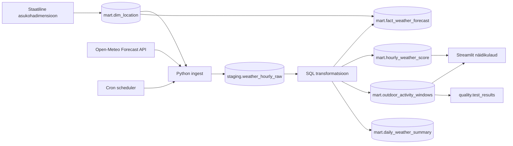

# Arhitektuur

## Äriküsimus

Millistes valdkondades registreeritakse enim uusi ettevõtteid ja kus on juhatuse muudatuste sagedus kõige kõrgem?

## Mõõdikud

1. Välitegevuse sobivuse skoor tunnipõhiselt.
2. Parimad 3-tunnised ajaaknad asukoha ja päeva lõikes.
3. Toetav kontekst: rahvastikujaotus maakondades.

## Andmeallikad

| Allikas | Tüüp | Muutuvus ajas | Kasutus |
|---|---|---|---|
| Open-Meteo Forecast API | Avalik HTTP API | Prognoos muutub ajas, kui ilmaennustust uuendatakse | Põhiandmevoog |
| `mart.dim_location` | Staatiline dimensioonitabel | Muutub ainult projekti muutmisel | Asukohtade püsivad tunnused ja API päringu koordinaadid |

Põhiandmevoog tuleb Open-Meteo API-st. Staatiline asukohadimensioon määrab, milliste asulate kohta prognoos laaditakse.

## Andmevoog

## Andmebaasi kihid

| Kiht | Roll |
|---|---|
| `staging` | Hoiab API-st saadud tunnipõhiseid ridu võimalikult allikalähedaselt. |
| `mart` | Hoiab asukohadimensiooni, ilmaennustuse fakti, tunniskoore, ajaaknaid ja koondeid. |
| `quality` | Hoiab kvaliteeditestide tulemusi. |

Iga töövoo käivitus saab uue `run_id`. Vanad API vastused jäävad `staging` kihti alles. `mart.dim_location` jääb staatiliseks dimensiooniks, teised `mart` tabelid ehitatakse uuesti ja näidikulaud loeb viimase eduka laadimise vaateid.

## Tööjaotus

| Roll | Vastutus |
|---|---|
| Andmeallika omanik | Kontrollib API vastust ja kirjutab sissevõtu loogika. |
| Transformatsioonide omanik | Kirjutab `mart` kihi tabelid ja mõõdikute arvutuse. |
| Kvaliteedi omanik | Kirjutab testid ja vaatab läbi ebaõnnestunud kontrollid. |
| Näidikulaua omanik | Ehitab Streamliti vaate ja seob selle äriküsimusega. |

Väikeses grupis võib üks inimene täita mitut rolli.

## Riskid

| Risk | Mõju | Maandus |
|---|---|---|
| API ei vasta või võrgupäring ebaõnnestub | Andmeid ei saa värskendada | Skript annab selge veateate; vajadusel käivita hiljem uuesti. |
| Prognoosi väljade nimed muutuvad | Laadimine katkeb | `validate_hourly_payload` kontrollib nõutud väljade olemasolu. |
| Skoori kaalud ei sobi kasutusjuhuga | Näidikulaud soovitab valesid ajaaknaid | Kaalud on SQL-is nähtavad ja muudetavad failis `scripts/01_transform.sql`. |
| Näidikulaud näitab vanu andmeid | Otsus põhineb aegunud infol | Näidikulaual kuvatakse viimase laadimise aeg. |
| Scheduler ei käivitu | Andmed ei värskene automaatselt | Kontrolli `docker compose logs -f scheduler` väljundit ja `.env` faili `PIPELINE_CRON` väärtust. |

## Privaatsus ja turve

Projekt kasutab ainult avalikke ilmaandmeid. Isikuandmeid ei koguta. Andmebaasi kasutajanimi ja parool tulevad `.env` failist. Päris `.env` faili ei tohi reposse lisada.
