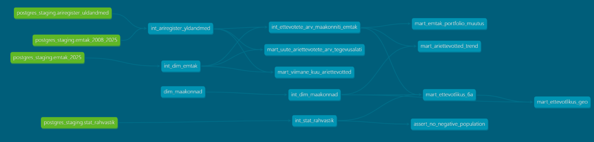

# Arhitektuur

## Äriküsimus

Millistes valdkondades registreeritakse enim uusi ettevõtteid ja millises maakonnas on ettevõtlikuimad tööealised elanikud?

Algselt formuleeritud äriküsimusest "Millistes valdkondades registreeritakse enim uusi ettevõtteid ja kus on juhatuse muudatuste sagedus kõige kõrgem?" jätsime välja juhatuse muudatuste sageduse, sest:
1. Äriregistri api ei pakkunud juhatuse muudatusi vaid registrikaardi muudatusi, millel ei olnud juhatuse liikmete muudatusi eristavat tunnust
2. Kuna esmane fookus oli "uued ettevõtted", siis juhatuse muudatused käiks kõikide tegutsevate etevõtete kohta, mis viiks meie teema laialivalguvaks
3. Kui oleks saanud äriregistrist kätte ainult juhatuse muudatused, siis puuduks arusaam, kas juhatuse muudatus oli seotud isku vahetusega või volituse tähtaja pikendamisega. Tasuta päringutes ei ole isikuandmete pärimise võimalust, et seda andmetest tuletada.

## Mõõdikud

Algsed
1. Uute ettevõtete arv tegevusvaldkonniti, maakonniti, aastati.
2. TOP5 enim kasvavat EMTAK valdkonda viimase 6kuu jooksul registreeritud ettevõtete arvu järgi.
3. Uute ettevõtete arv 1000 elaniku kohta maakonniti, aastati.

Tegelik
1. Uute ettevõtete arv tegevusvaldkonniti, maakonniti, jur isiku tüübiti viimasel libiseval aastal
2. Viimase 30 päeva jooksul asuttaud äriettevõtete populaarseimad tegevusvaldkonnad
3. Ettevõtlikus maakonniti ja tegevusalati viimasel või mistahes libiseval aastal vahemikus 2021-2026 (kaart)
4. Uute ettevõtete arv maakonniti 1000 tööealise elaniku kohta aastati (libisevad aastad 2021-2026) ja tegevusalati
5. Tegevusalade osakaalud ja nende erinevus viimasel libiseval aastal loodud uute ettevõtete ja enne seda loodud ettevõtete hulgas
6. Äriettevõtete asutamise trend äriregistri loomise algusest kuni tänaseni Eesti regioonide kaupa

Lisaks on kuvatud välja
6. Viimase 30päeva jooksul loodud äriettevõtete arv
7. Maksimaalne kuupäev, mille kohta andmed on laetud.

## Andmeallikad

| Allikas | Tüüp | Muutuvus ajas | Kasutus |
|---|---|---|---|
| Äriregistri avaandmete API | Avalik HTTP API | Igapäevased muutuste väljavõtted | Põhiandmevoog |
| Statistikaameti PxWeb API | Avalik JSON-stat API | Uueneb kord kuus | Rahvastiku andmed maakondade kaupa iga aasta alguse seisuga|
| EMTAK_2025.csv | Staatiline failiressurss | Automaatselt ei muutu. Muutub kui ise muuta | EMTAK tasemete nimekiri |
| EMTAK_uleminekutabel_2008_EMTAK_2025.csv | Staatiline failiressurss | Automaatselt ei muutu. Muutub kui ise muuta | EMTAK üleminekutabel |
| Maakondade ISO koodid, mida kasutab Superset | DBT seeds | Automaatselt ei muutu. Muutub kui ise muuta | Supersetti laadimiseks, et Supersetis kuvada visuaalselt maakondi. |

## Andmevoog

**Toorandmed**
- `staging.ariregister_uldandmed` — toorandmed RIK API-st (`reg_kood`, `oiguslik_vorm`,`asutamise_kuupaev`, `maakond`, `staatus`, `emtak_kood`,`emtak_nimetus`,`emtak_versioon`, `loaded_at`)
- `staging.stat_rahvastik` — toorandmed Statistikaametist (`aasta`, `vanusegrupp`, `maakond`, `sugu`, `rahvus`,`elanike_arv`, `loaded_at`)
- `emtak_2025` — tegevusalade klassifikaator (`id`, `kood`, `vanem`, `tegevusala_tekst`, `siia_kuulub`,`siia_kuulub_veel`,`siia_ei_kuulu`,`erialaliidud`,`on_erinõudeid`, `created_at`)
- `emtak_2008_2025` — tegevusalade klassifikaatorite üleminekutabel (`id`, `kood_emtak_2008`, `tegevusala_tekst_emtak_2008`, `kood_emtak_2025`, `tegevusala_tekst_emtak_2025`,`märkused`,`created_at`)
- `intermediate.dim_maakond` — genereeritud dbt/seeds  csv faili alusel (`maakond_id`, `maakond_nimi`, `iso_kood`,`regioon`, `kuvajarjestus`)

**Põhilised arvutused intermediate kihis:**
- `intermediate.dim_emtak` — emtak_2025 tegevusalad, millele on leitud algandmetest kõrgeim tase e emtak_jaotis igale koodile sõltumata selle tasemest
- `intermediate.int_ariregister_yldandmed`:
    - oiguslik_vorm grupeeritud kolmeks: 1_äriettevõtted, 2_FIE, 3_Muud_jur_isikud;
    - asutamise kuupäeva ja hetkekuupäeva alusel leitud libisev aasta
    - lisatud tunnus viimased_6a, millega lihtsasti eristada viimast kuut libisevat aastat
    - maakonna nimest eemaldatud ' maakond'
    - emtak_kood ja toortabeli `emtak_2008_2025` alusel leitud emtak_2008 koodi asemele kood, mis vastab emtak_2025 klassifikaatorile
- `intermediate.int_ettevotete_arv_maakonniti_emtak`:
    - eelmisele vaatele lisatud emtak_jaotis ehk kõrgeima jaotise tunnus ja nimi
    - välistatud oigusliku vormi grupp '3_Muud_jur_isikud'
    - grupeeritud andmed aasta, maakonna, emtak_jaotis ja ajaperioodi (viimased_6a) alusel
- `intermediate.int_stat_rahvastik`:
    - eemaldatud liigsed summeerivad (vanused, piirkonnad) v liigsed detailread (rahvus, sugu)
    - eemaldatud ' maakond' maakonna nimest
    - kaasatud ainult read, mille maakonna nimes oli 'maakond'
    - vanusegrupid grupeeritud vanuserühmadesse 1_noored_0-19, 2_ettevõtlikud_20_74 ja 3_vanurid_75+

**Põhilised arvutused marts kihis:**
- `marts.mart_ettevotlikus_6a`:
    - rahvastiku andmetest võetud 6 viimast aastat, vasnuserühm '2_ettevõtlikud_20-74', summeeritud aasta ja maakonna lõikes
    - ettevõtete andmetest võetud viimase 6a summeeritud andmed
    - ettevõtete ja rahvastiku andmed seotud aastanumbriga ja maakonnaga
- `marts.mart_ettevotlikus_geo`:
    - eelnevale andmestikule lisatud maakonna iso kood map-joonise tarbeks
- `marts.mart_uute_ariettevotete_arv_tegevusalati`:
    - filtris on ainult viimane liikuv aasta
    - kuvatakse välja kõik erinevad oiguslikud grupid, mistõttu kasutatakse allikana intermediate kihi tabelit. Lisatakse emtak_jaotus, mida seal pole
- `marts.mart_emtak_portfolio_muutus`:
    - tekitatakse kaks gruppi: ettevõtted, mis on asutatud viimasel liikuval aastal ja enne seda, et võrrelda nende gruppide tegevusalade jaotisi
- `marts.mart_ariettevotted_trend`:
    - intermediate vaatele lisatakse maakond tabelist regioon, et joongraafikul poleks arusaamatult palju jooni.
    - ei piirata aastat, et näha trendi äriregistri algusest (liikuvad aastad)
- `marts.mart_viimane_kuu_ariettevotted`:
    - viimase 30 päeva jooksul asutatud ettevõtted tegevusalati ja maakonniti
    - lisatakse emtak_jaotis

## Andmebaasi kihid

| Kiht | Roll |
|---|---|
| `staging` | Hoiab API-st saadud read allikalähedaselt. |
| `intermediate` | Andmete transformatsiooni kiht. |
| `marts` | Analüütikaks ehitatud tabelid (Supersetti loetav kiht). |
| `quality` | Hoiab kvaliteeditestide tulemusi. |

## Tööjaotus

| Roll | Vastutus | Täitja |
|---|---|---|
| Andmeallika omanik | Kontrollib API vastust ja kirjutab sissevõtu loogika. | Merliti, Sander
| Transformatsioonide omanik | Kirjutab `mart` kihi tabelid ja mõõdikute arvutuse. | Merliti, Sander
| Kvaliteedi omanik | Kirjutab testid ja vaatab läbi ebaõnnestunud kontrollid. | Kaja, Neeme, Merliti, Sander
| Airflow omanik | Airflow seadistamine. | Neeme
| Näidikulaua omanik | Ehitab Superseti dashboardi ja seob selle äriküsimusega. | Kaja

## Riskid

| Risk | Mõju | Maandus |
|---|---|---|
| Äriregistri või Statistikaameti API limiteerib päringute arvu või on ajutiselt maas | Andmeid ei saa värskendada. Vananenud andmed. | Skript annab veateate ning vajadusel uuesti käivitada. |
| Andmetüüpide ootamatu muutumine | Andmete laadimine peatub kuni koodi parandamiseni. | Test, mis kontrollib, kas parsimisel tuli andmeid. |
| EMTAK tegevusvaldkondi on väga palju | Dashboard ei ole hästi loetav. | Tegevusvaldkonad agregeerida.

## Privaatsus ja turve

Projekt kasutab ainult avalikke andmeid. Isikuandmeid ei käsitleta. Ettevõtte nimesid sisse ei impordita, et mitte minna vastuollu GDPR nõudmistega (sest FIE nimi on sama, mis ettevõtte asutaja nimi). Andmebaasi, Airflow, Superseti ja Dbt kasutajad ning paroolid on ainult .env failis, mis on .gitignore. Repos on ainult .env.example koos näiteväärtustega.
